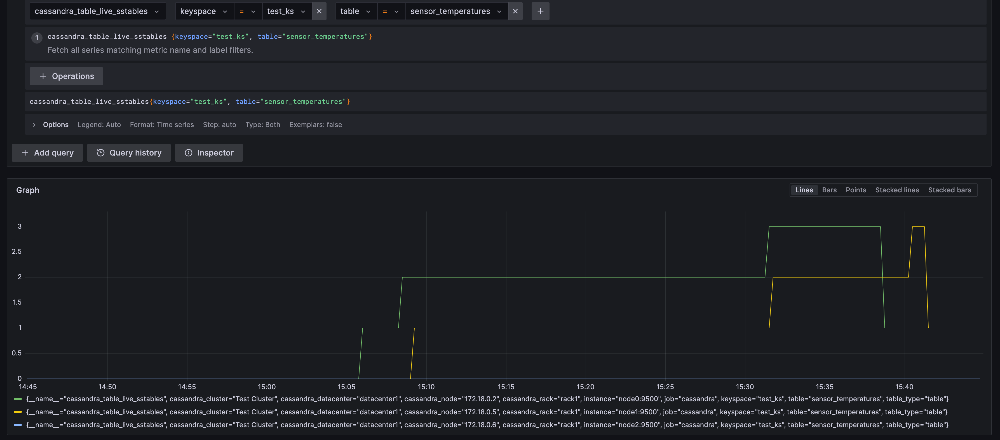

### Connecting to sqlsh

* `docker exec -it node0 /bin/bash`
* Once inside a container, `cqlsh`

### Creating a keyspace
```
CREATE KEYSPACE test_ks WITH REPLICATION = {'class': 'SimpleStrategy', 'replication_factor': 2};
```

### Creating a table
```
CREATE TABLE sensor_temperatures (sensor_id TEXT, t timestamp, temp float, PRIMARY KEY ((sensor_id), t));
```

Here, `sensor_id` is the partition key, `t` is the clustering key. All the data belonging to a given value of `sensor_id` would be stored in a single partition (file) on a single node (and replicated `replication_factor - 1` times across other nodes).


### Look at the keyspace
```
shaarad@MacBookPro ~ % docker exec node0 nodetool status test_ks
Datacenter: datacenter1
=======================
Status=Up/Down
|/ State=Normal/Leaving/Joining/Moving
--  Address     Load        Tokens  Owns (effective)  Host ID                               Rack
UN  172.18.0.6  144.33 KiB  16      76.0%             23966d83-4c46-46f6-b4a1-38a9d8f53de3  rack1
UN  172.18.0.2  138.87 KiB  16      64.7%             ee60e784-46b3-42ca-b890-757b0ea63ed3  rack1
UN  172.18.0.5  140.77 KiB  16      59.3%             7db96b60-9733-46e6-8c9f-87d935163ec6  rack1
```

* As the `replication_factor` is `2`, the sum of effective ownership is `(76.0 + 64.7 + 59.3)` = `200%`. The actual data amount owned by host `23966d83-....` in this case would be 76/2 = 38%.
* Each physical node (container) has 16 vNodes - meaning 16 virtual nodes in the consistent hashing ring. Hence there are 16 * 3 = 48 entries in the `nodetool ring test_ks` execution below.

### Looking at the ring for the keyspace
```
shaarad@MacBookPro ~ % docker exec node0 nodetool ring test_ks

Datacenter: datacenter1
==========
Address          Rack        Status State   Load            Owns                Token
                                                                                8929374636794624570
172.18.0.5       rack1       Up     Normal  140.77 KiB      59.34%              -9091082935633797655
172.18.0.6       rack1       Up     Normal  146.4 KiB       75.99%              -8660071454703129571
172.18.0.2       rack1       Up     Normal  138.87 KiB      64.66%              -8393354021207369034
172.18.0.6       rack1       Up     Normal  146.4 KiB       75.99%              -7993140705782188735
172.18.0.5       rack1       Up     Normal  140.77 KiB      59.34%              -7740881109059119771
172.18.0.2       rack1       Up     Normal  138.87 KiB      64.66%              -7297312120972430745
172.18.0.6       rack1       Up     Normal  146.4 KiB       75.99%              -6935584021092140176
172.18.0.5       rack1       Up     Normal  140.77 KiB      59.34%              -6683504592130161554
172.18.0.2       rack1       Up     Normal  138.87 KiB      64.66%              -6206015010280218485
172.18.0.6       rack1       Up     Normal  146.4 KiB       75.99%              -5693145706412008024
172.18.0.2       rack1       Up     Normal  138.87 KiB      64.66%              -5361638362789056728
172.18.0.6       rack1       Up     Normal  146.4 KiB       75.99%              -4866299249673894753
172.18.0.5       rack1       Up     Normal  140.77 KiB      59.34%              -4561809692127926444
172.18.0.6       rack1       Up     Normal  146.4 KiB       75.99%              -4201790547496636678
172.18.0.2       rack1       Up     Normal  138.87 KiB      64.66%              -3921370132886473488
172.18.0.6       rack1       Up     Normal  146.4 KiB       75.99%              -3539659041194395442
172.18.0.5       rack1       Up     Normal  140.77 KiB      59.34%              -3303389100984273410
172.18.0.2       rack1       Up     Normal  138.87 KiB      64.66%              -2849869516546440676
172.18.0.6       rack1       Up     Normal  146.4 KiB       75.99%              -2477306641524043903
172.18.0.5       rack1       Up     Normal  140.77 KiB      59.34%              -2239048111211210014
172.18.0.2       rack1       Up     Normal  138.87 KiB      64.66%              -1832018111804013660
172.18.0.6       rack1       Up     Normal  146.4 KiB       75.99%              -1339180102134148911
172.18.0.2       rack1       Up     Normal  138.87 KiB      64.66%              -1014346179191662866
172.18.0.5       rack1       Up     Normal  140.77 KiB      59.34%              -419043810231263616
172.18.0.2       rack1       Up     Normal  138.87 KiB      64.66%              61409702033916672
172.18.0.6       rack1       Up     Normal  146.4 KiB       75.99%              492735626820933770
172.18.0.2       rack1       Up     Normal  138.87 KiB      64.66%              797325394744810313
172.18.0.6       rack1       Up     Normal  146.4 KiB       75.99%              1207031091218594763
172.18.0.5       rack1       Up     Normal  140.77 KiB      59.34%              1458020519281722412
172.18.0.2       rack1       Up     Normal  138.87 KiB      64.66%              1876698202192411971
172.18.0.6       rack1       Up     Normal  146.4 KiB       75.99%              2324269542090292357
172.18.0.5       rack1       Up     Normal  140.77 KiB      59.34%              2626975442460736791
172.18.0.2       rack1       Up     Normal  138.87 KiB      64.66%              3120218207873003943
172.18.0.5       rack1       Up     Normal  140.77 KiB      59.34%              3676099242789927879
172.18.0.2       rack1       Up     Normal  138.87 KiB      64.66%              4087582450951539442
172.18.0.5       rack1       Up     Normal  140.77 KiB      59.34%              4612012415581443299
172.18.0.5       rack1       Up     Normal  140.77 KiB      59.34%              5027650075153083179
172.18.0.6       rack1       Up     Normal  146.4 KiB       75.99%              5395993266779858497
172.18.0.2       rack1       Up     Normal  138.87 KiB      64.66%              5677587003465438080
172.18.0.5       rack1       Up     Normal  140.77 KiB      59.34%              6239330421825064324
172.18.0.5       rack1       Up     Normal  140.77 KiB      59.34%              6636653274173777115
172.18.0.6       rack1       Up     Normal  146.4 KiB       75.99%              7028474230784122548
172.18.0.2       rack1       Up     Normal  138.87 KiB      64.66%              7296610299162481377
172.18.0.6       rack1       Up     Normal  146.4 KiB       75.99%              7661458054257256671
172.18.0.5       rack1       Up     Normal  140.77 KiB      59.34%              7895073990119220203
172.18.0.2       rack1       Up     Normal  138.87 KiB      64.66%              8274755751678595453
172.18.0.6       rack1       Up     Normal  146.4 KiB       75.99%              8639348910650745335
172.18.0.5       rack1       Up     Normal  140.77 KiB      59.34%              8929374636794624570
```

### Inserting data 

Insert data into the created table against a particular partition key. Open `cqlsh` on `node0` and
```cqlsh
INSERT INTO test_ks.sensor_temperatures (sensor_id, t, temp) VALUES ('sensor_0', 1683366192527, 12.23);
```

Now let's find out where the data got placed on the ring - this will tell which nodes are actually responsible for storing data for partition value `sensor_0`.

```cqlsh
cqlsh:test_ks> select token(sensor_id), count(*) from sensor_temperatures where sensor_id = 'sensor_0' group by sensor_id;

 system.token(sensor_id) | count
-------------------------+-------
     2542236581424396098 |     1

(1 rows)
```

`token(sensor_id)` gave the value of the token on the ring. This value `2542236581424396098` falls between `2324269542090292357` and `2626975442460736791`.

Here are the rows of interest from above table - 
```
Address          Rack        Status State   Load            Owns                Token
...
172.18.0.6       rack1       Up     Normal  146.4 KiB       75.99%              2324269542090292357
172.18.0.5       rack1       Up     Normal  140.77 KiB      59.34%              2626975442460736791
172.18.0.2       rack1       Up     Normal  138.87 KiB      64.66%              3120218207873003943
...
```

This tells that all values whose token falls in the range (2324269542090292357, 2626975442460736791] will be sent to `172.18.0.5`. Also as for keyspace `test_ks`, the replication strategy is `SimpleStrategy` the replication will happen on the node after the first one (which is `172.18.0.2`). Since the `replication_factor` is 2, the data would be replicated to one extra node after the first one, which happens to be `172.18.0.2`.

### Inserting more data and validations

Insert more data under the `sensor_0` partition - 

`docker exec -it node0 /bin/bash`

```
root@b1e4ac72c8a8:/# while true; do $(cqlsh -e "INSERT INTO test_ks.sensor_temperatures (sensor_id, t, temp) VALUES ('sensor_0', $(date +%s%N), $(( ( RANDOM % 100 )  + 1 )));"); sleep 1;  done
```

This will keep inserting 1 row per second into the database.

After a while,

```cqlsh
cqlsh:test_ks> select token(sensor_id), count(*) from sensor_temperatures where sensor_id = 'sensor_0' group by sensor_id;

 system.token(sensor_id) | count
-------------------------+-------
     2542236581424396098 |   975

(1 rows)
```

At this point, running 

```
shaarad@MacBookPro ~ % docker exec node0 nodetool tablestats test_ks.sensor_temperatures
Total number of tables: 45
----------------
Keyspace : test_ks
	Read Count: 48
	Read Latency: 0.25452083333333336 ms
	Write Count: 983
	Write Latency: 0.06468158697863682 ms
	Pending Flushes: 0
		Table: sensor_temperatures
		SSTable count: 0
		Old SSTable count: 0
		Space used (live): 0
		Space used (total): 0
		Space used by snapshots (total): 0
		Off heap memory used (total): 0
		SSTable Compression Ratio: -1.0
		Number of partitions (estimate): 0
		Memtable cell count: 983
		Memtable data size: 48175
		Memtable off heap memory used: 0
		Memtable switch count: 0
		Local read count: 48
		Local read latency: NaN ms
		Local write count: 983
		Local write latency: 0.064 ms
		Pending flushes: 0
		Percent repaired: 100.0
		Bytes repaired: 0.000KiB
		Bytes unrepaired: 0.000KiB
		Bytes pending repair: 0.000KiB
		Bloom filter false positives: 0
		Bloom filter false ratio: 0.00000
		Bloom filter space used: 0
		Bloom filter off heap memory used: 0
		Index summary off heap memory used: 0
		Compression metadata off heap memory used: 0
		Compacted partition minimum bytes: 0
		Compacted partition maximum bytes: 0
		Compacted partition mean bytes: 0
		Average live cells per slice (last five minutes): NaN
		Maximum live cells per slice (last five minutes): 0
		Average tombstones per slice (last five minutes): NaN
		Maximum tombstones per slice (last five minutes): 0
		Dropped Mutations: 0
		Droppable tombstone ratio: 0.00000

----------------
```

Interesting properties are 
* `SSTable count: 0` - The data written till now is all in MemTable. It's not yet flushed to disk to SSTables.
* `Memtable cell count: 983` - MemTable has 983 rows in memory.

### Trigger MemTable flush to disk

Using `nodetool flush` after sometime

```
shaarad@MacBookPro ~ % docker exec node0 nodetool flush test_ks
```

Doing this for `node1` and `node2` as well.

```
shaarad@MacBookPro ~ % docker exec node0 nodetool tablestats test_ks.sensor_temperatures
Total number of tables: 45
----------------
Keyspace : test_ks
	Read Count: 48
	Read Latency: 0.25452083333333336 ms
	Write Count: 1006
	Write Latency: 0.06487574552683897 ms
	Pending Flushes: 0
		Table: sensor_temperatures
		SSTable count: 1
		Old SSTable count: 0
		Space used (live): 19734
		Space used (total): 19734
		Space used by snapshots (total): 0
		Off heap memory used (total): 44
		SSTable Compression Ratio: 0.6664702416028285
		Number of partitions (estimate): 2
		Memtable cell count: 4
		Memtable data size: 204
		Memtable off heap memory used: 0
		Memtable switch count: 1
		Local read count: 48
		Local read latency: NaN ms
		Local write count: 1006
		Local write latency: 0.067 ms
		Pending flushes: 0
		Percent repaired: 0.0
		Bytes repaired: 0.000KiB
		Bytes unrepaired: 21.544KiB
		Bytes pending repair: 0.000KiB
		Bloom filter false positives: 0
		Bloom filter false ratio: 0.00000
		Bloom filter space used: 16
		Bloom filter off heap memory used: 8
		Index summary off heap memory used: 20
		Compression metadata off heap memory used: 16
		Compacted partition minimum bytes: 20502
		Compacted partition maximum bytes: 24601
		Compacted partition mean bytes: 24601
		Average live cells per slice (last five minutes): NaN
		Maximum live cells per slice (last five minutes): 0
		Average tombstones per slice (last five minutes): NaN
		Maximum tombstones per slice (last five minutes): 0
		Dropped Mutations: 0
		Droppable tombstone ratio: 0.00000

----------------
```

* `SSTable count: 1` - This increased to 1.
* `Memtable switch count: 1` - This increased to 1.

Doing this a couple times more and then executing `nodetool ring test_ks` once again, 

```
shaarad@MacBookPro ~ % docker exec node2 nodetool ring test_ks

Datacenter: datacenter1
==========
Address          Rack        Status State   Load            Owns                Token
                                                                                8929374636794624570
172.18.0.5       rack1       Up     Normal  212.53 KiB      59.34%              -9091082935633797655
172.18.0.6       rack1       Up     Normal  197.25 KiB      75.99%              -8660071454703129571
172.18.0.2       rack1       Up     Normal  246.23 KiB      64.66%              -8393354021207369034
172.18.0.6       rack1       Up     Normal  197.25 KiB      75.99%              -7993140705782188735
172.18.0.5       rack1       Up     Normal  212.53 KiB      59.34%              -7740881109059119771
172.18.0.2       rack1       Up     Normal  246.23 KiB      64.66%              -7297312120972430745
172.18.0.6       rack1       Up     Normal  197.25 KiB      75.99%              -6935584021092140176
172.18.0.5       rack1       Up     Normal  212.53 KiB      59.34%              -6683504592130161554
172.18.0.2       rack1       Up     Normal  246.23 KiB      64.66%              -6206015010280218485
172.18.0.6       rack1       Up     Normal  197.25 KiB      75.99%              -5693145706412008024
172.18.0.2       rack1       Up     Normal  246.23 KiB      64.66%              -5361638362789056728
172.18.0.6       rack1       Up     Normal  197.25 KiB      75.99%              -4866299249673894753
172.18.0.5       rack1       Up     Normal  212.53 KiB      59.34%              -4561809692127926444
172.18.0.6       rack1       Up     Normal  197.25 KiB      75.99%              -4201790547496636678
172.18.0.2       rack1       Up     Normal  246.23 KiB      64.66%              -3921370132886473488
172.18.0.6       rack1       Up     Normal  197.25 KiB      75.99%              -3539659041194395442
172.18.0.5       rack1       Up     Normal  212.53 KiB      59.34%              -3303389100984273410
172.18.0.2       rack1       Up     Normal  246.23 KiB      64.66%              -2849869516546440676
172.18.0.6       rack1       Up     Normal  197.25 KiB      75.99%              -2477306641524043903
172.18.0.5       rack1       Up     Normal  212.53 KiB      59.34%              -2239048111211210014
172.18.0.2       rack1       Up     Normal  246.23 KiB      64.66%              -1832018111804013660
172.18.0.6       rack1       Up     Normal  197.25 KiB      75.99%              -1339180102134148911
172.18.0.2       rack1       Up     Normal  246.23 KiB      64.66%              -1014346179191662866
172.18.0.5       rack1       Up     Normal  212.53 KiB      59.34%              -419043810231263616
172.18.0.2       rack1       Up     Normal  246.23 KiB      64.66%              61409702033916672
172.18.0.6       rack1       Up     Normal  197.25 KiB      75.99%              492735626820933770
172.18.0.2       rack1       Up     Normal  246.23 KiB      64.66%              797325394744810313
172.18.0.6       rack1       Up     Normal  197.25 KiB      75.99%              1207031091218594763
172.18.0.5       rack1       Up     Normal  212.53 KiB      59.34%              1458020519281722412
172.18.0.2       rack1       Up     Normal  246.23 KiB      64.66%              1876698202192411971
172.18.0.6       rack1       Up     Normal  197.25 KiB      75.99%              2324269542090292357
172.18.0.5       rack1       Up     Normal  212.53 KiB      59.34%              2626975442460736791
172.18.0.2       rack1       Up     Normal  246.23 KiB      64.66%              3120218207873003943
172.18.0.5       rack1       Up     Normal  212.53 KiB      59.34%              3676099242789927879
172.18.0.2       rack1       Up     Normal  246.23 KiB      64.66%              4087582450951539442
172.18.0.5       rack1       Up     Normal  212.53 KiB      59.34%              4612012415581443299
172.18.0.5       rack1       Up     Normal  212.53 KiB      59.34%              5027650075153083179
172.18.0.6       rack1       Up     Normal  197.25 KiB      75.99%              5395993266779858497
172.18.0.2       rack1       Up     Normal  246.23 KiB      64.66%              5677587003465438080
172.18.0.5       rack1       Up     Normal  212.53 KiB      59.34%              6239330421825064324
172.18.0.5       rack1       Up     Normal  212.53 KiB      59.34%              6636653274173777115
172.18.0.6       rack1       Up     Normal  197.25 KiB      75.99%              7028474230784122548
172.18.0.2       rack1       Up     Normal  246.23 KiB      64.66%              7296610299162481377
172.18.0.6       rack1       Up     Normal  197.25 KiB      75.99%              7661458054257256671
172.18.0.5       rack1       Up     Normal  212.53 KiB      59.34%              7895073990119220203
172.18.0.2       rack1       Up     Normal  246.23 KiB      64.66%              8274755751678595453
172.18.0.6       rack1       Up     Normal  197.25 KiB      75.99%              8639348910650745335
172.18.0.5       rack1       Up     Normal  212.53 KiB      59.34%              8929374636794624570
```

The interesting rows are - 
```
Address          Rack        Status State   Load            Owns                Token
...
172.18.0.6       rack1       Up     Normal  197.25 KiB      75.99%              2324269542090292357
172.18.0.5       rack1       Up     Normal  212.53 KiB      59.34%              2626975442460736791
172.18.0.2       rack1       Up     Normal  246.23 KiB      64.66%              3120218207873003943
...
```

The nodes `172.18.0.5` and `172.18.0.2` have their load (data storage) increased. `172.18.0.6` has the storage increased a bit as well, and it's not very apparent that the increase in load on `.5` and `.2` is due the inserted data, but if significant data is inserted, the load will be considerably more than `.6`.

After multiple flushes, the `SSTable count` increases. To compact them, `nodetool compact` can be used. In our minimal data case, this simply compacts all the SSTables into a single SSTable.

`docker exec node0 nodetool compact test_ks sensor_temperatures`

This needs to be executed on individual containers as the flush and compaction process is specific to a given node.

The drop in `cassandra_table_live_sstables` to 1 is shown below- 

